# Hyper dimensional orthogonal maze generation algorithms

An experimental implementation of some common Maze generation algorithms modified to support N dimensions. All topics loosely inspired by the [Mazes for Programmers](https://pragprog.com/book/jbmaze/mazes-for-programmers) book.

1. [Defining a Maze](#defining-a-maze)
1. [Rendering the Mazes](#rendering-the-mazes)
1. [Algorithm Implementations](#algorithm-implementations)
    1. [Binary](#binary)
    1. [Sidewinder](#sidewinder)
    1. [Aldous-Broder](#aldous-broder)
    1. [Wilsons](#wilsons)
    1. [Recursive Backtracker](#recursive-backtracker)
1. [Developer Notes](#developer-notes)
   1. [Dependencies](#dependencies)

These modifications are not all very performant, particularly the `Node` and `Point` classes which are the foundation of the dimension agnostic mazes. If you try and run anything higher than a 5th dimensional maze you really have to reduce the length of that dimension down, otherwise you're looking at a 30 minute runtime for even the simplest maze generation algorithm. 

## Defining a Maze

Maze generation algorithms don't actually have any concept of the "start" or "end" of a maze and they simply carve out connections between different nodes. This isn't ideal as we can't really appreciate any weaving or texture within the maze without inspecting it in some way.

The following approach of forcing a "start" and "end" node into a maze helps highlight defining characteristics of the different algorithms as each algorithm has its own footprint.

The approach taken for this project is

1. Generate a maze using any algorithm.
1. Collect a list of all "Dead end" nodes that touch the edge of the maze.
3. Compute the "all pairs all paths" problem between all of these dead ends.
4. Find the pairs with the longest distance and mark them as the "start" and "end".

There are some cool performance modifications to the breadth first search described in step 3, if you are interested the entrypoints are [`src/graph/solver.h`](src/graph/solver.h) and [`src/graph/dijkstra.h`](src/graph/dijkstra.h).

## Rendering the Mazes

|  | OpenGL | CLI output |
|---|---|---|
| 2D | :white_check_mark: |:white_check_mark:  |
| 3D | :white_check_mark: |:white_check_mark:  |
| ND | :x: |:white_check_mark:  |

All mazes render with a text CLI output, highlighting the start node, the end node, and the path required to navigate between them.

2D and 3D mazes can have their graphs rendered using OpenGl. 3D mazes render like a stacked 2D maze, however it's difficult to see the solution happening "inside" the maze so only the 3D solution is included in this document.

I tried [TODO LINK] to build a renderer for a 4 dimensional maze, however what I saw didn't make much sense. I suspect this is expected unless you slip LSD in your tea.

# Algorithm Implementations

## Binary

:arrow_up: [ Back to top ](#hyper-dimensional-orthogonal-maze-generation-algorithms)

See [`src/graph/maze/mazebinary.h`](src/graph/maze/mazebinary.h)
Click [here](http://weblog.jamisbuck.org/2011/2/1/maze-generation-binary-tree-algorithm) to read more about this algorithm.

This was quite a simple one to translate into higher dimensions, simply stack the extra dimensions in the maze and pick a possible dimension form the list.

The binary algorithm forms a solution with very distinctive V shape snaking from one edge of the maze to another, this is still visible in 3D.

There are long spanning paths across one edge of each axis.


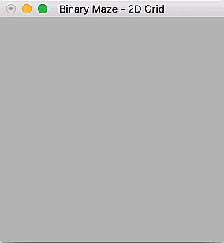
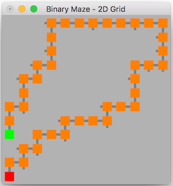
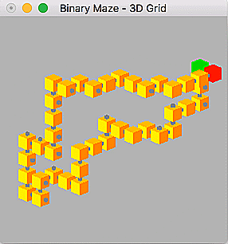

| [Read full 2D solution log](readme/binary_2d.log)&nbsp;&nbsp;&nbsp;&nbsp;&nbsp;&nbsp;&nbsp;&nbsp;&nbsp;&nbsp;&nbsp;&nbsp;&nbsp;&nbsp;&nbsp;&nbsp;&nbsp;&nbsp;&nbsp;&nbsp;&nbsp;&nbsp;&nbsp;&nbsp;&nbsp;&nbsp;&nbsp;&nbsp;&nbsp;&nbsp;&nbsp;&nbsp;&nbsp;&nbsp;&nbsp;&nbsp;&nbsp;&nbsp;&nbsp;&nbsp;&nbsp;&nbsp;&nbsp;&nbsp;&nbsp;|  [Read full 3D solution log](readme/binary_3d.log) &nbsp;&nbsp;&nbsp;&nbsp;&nbsp;&nbsp;&nbsp;&nbsp;&nbsp;&nbsp;&nbsp;&nbsp;&nbsp;&nbsp;&nbsp;&nbsp;&nbsp;&nbsp;&nbsp;&nbsp;&nbsp;&nbsp;&nbsp;&nbsp;&nbsp;&nbsp;&nbsp;&nbsp;&nbsp;&nbsp;&nbsp;&nbsp;&nbsp;&nbsp;&nbsp;&nbsp;&nbsp;&nbsp;&nbsp;&nbsp;&nbsp;&nbsp;&nbsp;&nbsp;&nbsp;&nbsp;&nbsp;&nbsp;&nbsp;&nbsp;&nbsp;&nbsp;&nbsp;&nbsp;&nbsp;&nbsp;&nbsp;&nbsp;|
|---|---|

```
Generating a Binary maze of 12 by 12           |        Generating a Binary maze of 8 by 8 by 8
Solution took 0.0354854 seconds                |        Solution took 1.0908 seconds
Solution has a distance of 42                  |        Solution has a distance of 41
(x:-6)(y:-3) to (x:-6)(y:-6)                   |        (x:-4)(y:-4)(z:-4) to (x:-2)(y:-4)(z:-4)
start at            (x:-6)(y:-3)               |        start at            (x:-4)(y:-4)(z:-4)
positive 1 on y     (x:-6)(y:-2)               |        positive 1 on z     (x:-4)(y:-4)(z:-3)
positive 1 on x     (x:-5)(y:-2)               |        positive 1 on z     (x:-4)(y:-4)(z:-2)
positive 1 on y     (x:-5)(y:-1)               |        positive 1 on x     (x:-3)(y:-4)(z:-2)
positive 1 on y     (x:-5)(y:0)                |        positive 1 on z     (x:-3)(y:-4)(z:-1)
positive 1 on x     (x:-4)(y:0)                |        positive 1 on y     (x:-3)(y:-3)(z:-1)
positive 1 on y     (x:-4)(y:1)                |        positive 1 on x     (x:-2)(y:-3)(z:-1)
positive 1 on y     (x:-4)(y:2)                |        positive 1 on x     (x:-1)(y:-3)(z:-1)
...Read full log for more...                   |        ...Read full log for more...
```

### Binary ND

A 4D binary solution is shown below.

It is interesting to note that the solution distance is similar for both a 2D, 3D, and a 4D maze

[Read full 4D solution log](readme/binary_4d.log)

```
$ ./binary_nd -d 4
Using seed: 1491155959567
Generating a Binary maze of 6 by 6 by 6 by 6
Ensuring solution
Solution took 15.0695 seconds and has a distance of 40
start at                                (A:0)(B:0)(C:0)(D:0)
positive 1 on D                         (A:0)(B:0)(C:0)(D:1)
positive 1 on A                         (A:1)(B:0)(C:0)(D:1)
positive 1 on A                         (A:2)(B:0)(C:0)(D:1)
positive 1 on C                         (A:2)(B:0)(C:1)(D:1)
positive 1 on A                         (A:3)(B:0)(C:1)(D:1)
positive 1 on C                         (A:3)(B:0)(C:2)(D:1)
positive 1 on A                         (A:4)(B:0)(C:2)(D:1)
positive 1 on C                         (A:4)(B:0)(C:3)(D:1)
positive 1 on D                         (A:4)(B:0)(C:3)(D:2)
positive 1 on C                         (A:4)(B:0)(C:4)(D:2)
positive 1 on A                         (A:5)(B:0)(C:4)(D:2)
...Read full log for more...
```

## Sidewinder

:arrow_up: [ Back to top ](#hyper-dimensional-orthogonal-maze-generation-algorithms)

See [`src/graph/maze/mazesidewinder.h`](src/graph/maze/mazesidewinder.h)
Click [here](http://weblog.jamisbuck.org/2011/2/3/maze-generation-sidewinder-algorithm) to read more about this algorithm.

The sidewinder algorithm is similar to the binary algorithm, however it results in one spanning path along a single axis of the maze. I refer to this as the "backbone" and you can see it on the left hand side of the 2D generation below.

The backbone and associated generation logic was very difficult to abstract for higher dimensions, and my solution is very buggy. The code fails far more frequently than it runs, and in order to get any usable output I had to reduce the size of the maze as the dimensions increase. You can still see a similar pattern in the small 3D maze as in the 2D maze, both solutions pass through the backbone on one axis.


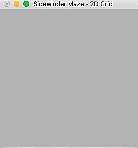
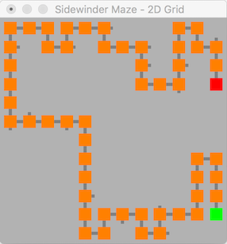
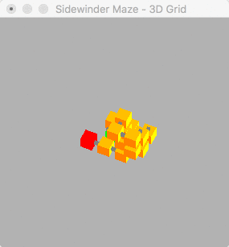

| [Read full 2D solution log](readme/sidewinder_2d.log)&nbsp;&nbsp;&nbsp;&nbsp;&nbsp;&nbsp;&nbsp;&nbsp;&nbsp;&nbsp;&nbsp;&nbsp;&nbsp;&nbsp;&nbsp;&nbsp;&nbsp;&nbsp;&nbsp;&nbsp;&nbsp;&nbsp;&nbsp;&nbsp;&nbsp;&nbsp;&nbsp;&nbsp;&nbsp;&nbsp;&nbsp;&nbsp;&nbsp;&nbsp;&nbsp;&nbsp;&nbsp;&nbsp;&nbsp;&nbsp;&nbsp;&nbsp;&nbsp;&nbsp;&nbsp;|  [Read full 3D solution log](readme/sidewinder_3d.log) &nbsp;&nbsp;&nbsp;&nbsp;&nbsp;&nbsp;&nbsp;&nbsp;&nbsp;&nbsp;&nbsp;&nbsp;&nbsp;&nbsp;&nbsp;&nbsp;&nbsp;&nbsp;&nbsp;&nbsp;&nbsp;&nbsp;&nbsp;&nbsp;&nbsp;&nbsp;&nbsp;&nbsp;&nbsp;&nbsp;&nbsp;&nbsp;&nbsp;&nbsp;&nbsp;&nbsp;&nbsp;&nbsp;&nbsp;&nbsp;&nbsp;&nbsp;&nbsp;&nbsp;&nbsp;&nbsp;&nbsp;&nbsp;&nbsp;&nbsp;&nbsp;&nbsp;&nbsp;&nbsp;&nbsp;&nbsp;|
|---|---|

```
Generating a Sidewinder maze of 12 by 12       |        Generating a Sidewinder maze of 5 by 5 by 5
Solution took 0.0258571                        |        Solution took 0.00741086 seconds
Solution has a distance of 54                  |        Solution has a distance of 15
(x:5)(y:-5) to (x:5)(y:2)                      |        (x:0)(y:-2)(z:-1) to (x:1)(y:-2)(z:0)
start at            (x:5)(y:-5)                |        start at            (x:0)(y:-2)(z:-1)
positive 1 on y     (x:5)(y:-4)                |        positive 1 on y     (x:0)(y:-1)(z:-1)
positive 1 on y     (x:5)(y:-3)                |        negative 1 on x     (x:-1)(y:-1)(z:-1)
positive 1 on y     (x:5)(y:-2)                |        negative 1 on x     (x:-2)(y:-1)(z:-1)
negative 1 on x     (x:4)(y:-2)                |        positive 1 on z     (x:-2)(y:-1)(z:0)
negative 1 on y     (x:4)(y:-3)                |        positive 1 on y     (x:-2)(y:0)(z:0)
negative 1 on y     (x:4)(y:-4)                |        positive 1 on z     (x:-2)(y:0)(z:1)
negative 1 on y     (x:4)(y:-5)                |        positive 1 on y     (x:-2)(y:1)(z:1)
...Read full log for more...                   |        ...Read full log for more...
```

### Sidewinder ND

Similar to the comments above, as the extra dimensions accrue the more likely you are to end up with multiple unlinked graphs rather than a uniform spanning tree. The more dimensions, the less likely this is to run. The length of each dimension has been reduced to demonstrate a working maze.

[Read full 4D solution log](readme/sidewinder_4d.log)

```
$ ./bin/sidewinder_nd -l 3
Generating a Sidewinder maze of 3 by 3 by 3 by 3
Ensuring solution
Solution took 0.0367572 seconds and has a distance of 16
start at            (A:1)(B:0)(C:0)(D:2)
positive 1 on B     (A:1)(B:1)(C:0)(D:2)
positive 1 on A     (A:2)(B:1)(C:0)(D:2)
positive 1 on B     (A:2)(B:2)(C:0)(D:2)
negative 1 on A     (A:1)(B:2)(C:0)(D:2)
positive 1 on C     (A:1)(B:2)(C:1)(D:2)
negative 1 on A     (A:0)(B:2)(C:1)(D:2)
negative 1 on C     (A:0)(B:2)(C:0)(D:2)
negative 1 on B     (A:0)(B:1)(C:0)(D:2)
negative 1 on B     (A:0)(B:0)(C:0)(D:2)
negative 1 on D     (A:0)(B:0)(C:0)(D:1)
negative 1 on D     (A:0)(B:0)(C:0)(D:0)
positive 1 on C     (A:0)(B:0)(C:1)(D:0)
positive 1 on B     (A:0)(B:1)(C:1)(D:0)
positive 1 on A     (A:1)(B:1)(C:1)(D:0)
finish at           (A:1)(B:0)(C:1)(D:0)
```

## Aldous-Broder

:arrow_up: [ Back to top ](#hyper-dimensional-orthogonal-maze-generation-algorithms)

See [`src/graph/maze/mazealdousbroder.h`](src/graph/maze/mazealdousbroder.h)
Click [here](http://weblog.jamisbuck.org/2011/1/17/maze-generation-aldous-broder-algorithm) to read more about this algorithm.


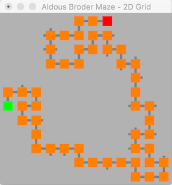
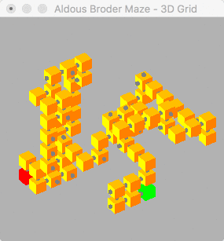

### Aldous-Broder ND

## Wilsons

:arrow_up: [ Back to top ](#hyper-dimensional-orthogonal-maze-generation-algorithms)

See [`src/graph/maze/mazewilsons.h`](src/graph/maze/mazewilsons.h)
Click [here](http://weblog.jamisbuck.org/2011/1/20/maze-generation-wilson-s-algorithm) to read more about this algorithm.


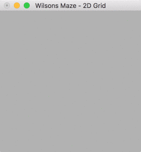
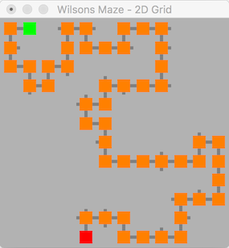
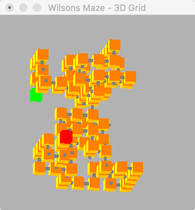

### Wilsons ND

## Recursive Backtracker

:arrow_up: [ Back to top ](#hyper-dimensional-orthogonal-maze-generation-algorithms)

See [`src/graph/maze/mazerecursivebacktracker.h`](src/graph/maze/mazerecursivebacktracker.h)
Click [here](http://weblog.jamisbuck.org/2010/12/27/maze-generation-recursive-backtracking) to read more about this algorithm.

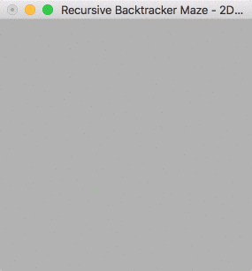
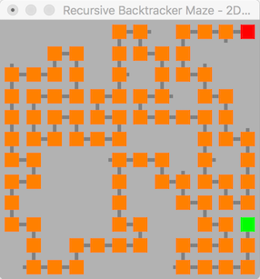
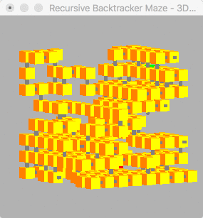

### Recursive Backtracker ND

# Developer Notes

## Dependencies

- OpenGL

    ```
    sudo apt-get install freeglut3
    sudo apt-get install freeglut3-dev
    ```
    
- [cxxopts](https://github.com/jarro2783/cxxopts)
- [NestedLoops.h](src/lib/NestedLoop/README.md)
