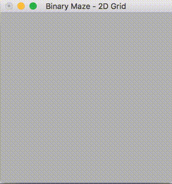
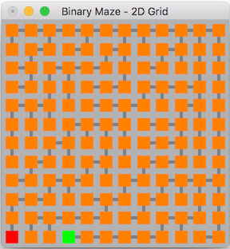

# mazes-for-programmers
A C++ and OpenGL implementation of different varieties of N-Dimensional mazes. All based very loosely on the topics covered in the [Mazes for Programmers](https://pragprog.com/book/jbmaze/mazes-for-programmers) book.

What this repo attempts to achieve is the following:

1. To break down typically described maze generation algorithms and to refactor them so that they are agnostic of any sense of Up/Down/Left/Rights. Any "dimensionality" in the algorithm needs removed.
2. Generate a 2D visualisation of the maze using the refactored algorithm, to validate that it works.
3. Using the same algorithm, generate a 3D visualisation to see what the potential maze and solution looks like with a new dimension.
4. Generate a 4D version of the maze. There are no visualisations for these higher dimensional mazes because I don't have access to that much LSD. This will simply output a text description of the mazes solution.

I'll start with the binary maze as an in depth example as it's the simplest. I'll go a bit more in depth to the process here to help explain what's going on.

# Binary Maze





# Aldous Broder

#Dependencies

- OpenGL

    ```
    sudo apt-get install freeglut3
    sudo apt-get install freeglut3-dev
    ```
    
- [cxxopts](https://github.com/jarro2783/cxxopts)
- [NestedLoops.h](src/lib/NestedLoop/README.md)
